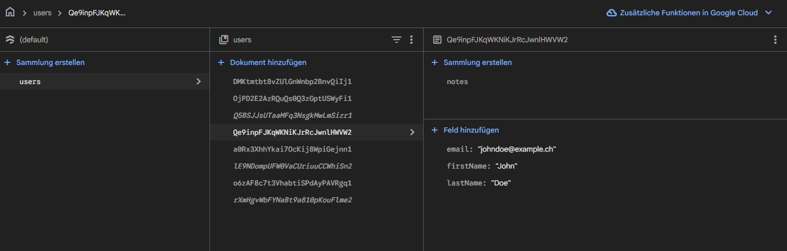

## M346 Cloud Projekt
#### Timeline: Oct 2025 - Dec 2025
[](https://vercel.com/)

---


#### Tech Stack

|                                                                                                                                                        |                  |                      |
| ------------------------------------------------------------------------------------------------------------------------------------------------------ | ---------------- | -------------------- |
|  | **Next.js**      | _Frontend & Backend_ |
|                                                                               | **Vercel**       | Hosting         |
|        | **Firebase**     | Database             |
|                                     | **Tailwind CSS** | Styling              |
|                                                                     | **Shadcn/UI**    | UI Library            |
|                                                                               | **Lucide**       | Icon Library          |


#### Firebase (Firestore) Structure


#### Notes
- not optimized:/
- Project doesn't use a real-time database (using Firestore), which makes the page reload often


---

install packages

```
npm i
```

start local server

```
npm run dev
```

---

.env.local

```
NEXT_PUBLIC_FIREBASE_API_KEY=
NEXT_PUBLIC_FIREBASE_AUTH_DOMAIN=
NEXT_PUBLIC_FIREBASE_PROJECT_ID=
NEXT_PUBLIC_FIREBASE_STORAGE_BUCKET=
NEXT_PUBLIC_FIREBASE_MESSAGING_SENDER_ID=
NEXT_PUBLIC_FIREBASE_APP_ID=
NEXT_PUBLIC_FIREBASE_MEASUREMENT_ID=
```

<h2 id="colab">Contributors</h2>
<table style="margin: 0 auto;">
    <tr>
        <td align="center">
            <a href="https://github.com/noqx78">
                <br>
                <sub><b>Noel</b></sub>
            </a>
        </td>
        <td align="center">
            <a href="https://github.com/KilianSchoeberl">
                <br>
                <sub><b>Kilian</b></sub>
            </a>
        </td>
        <td align="center">
            <a href="https://github.com/Specter0408">
                <br>
                <sub><b>Elias</b></sub>
            </a>
        </td>
    </tr>
</table>
